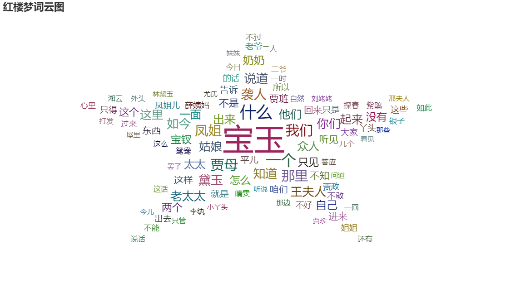
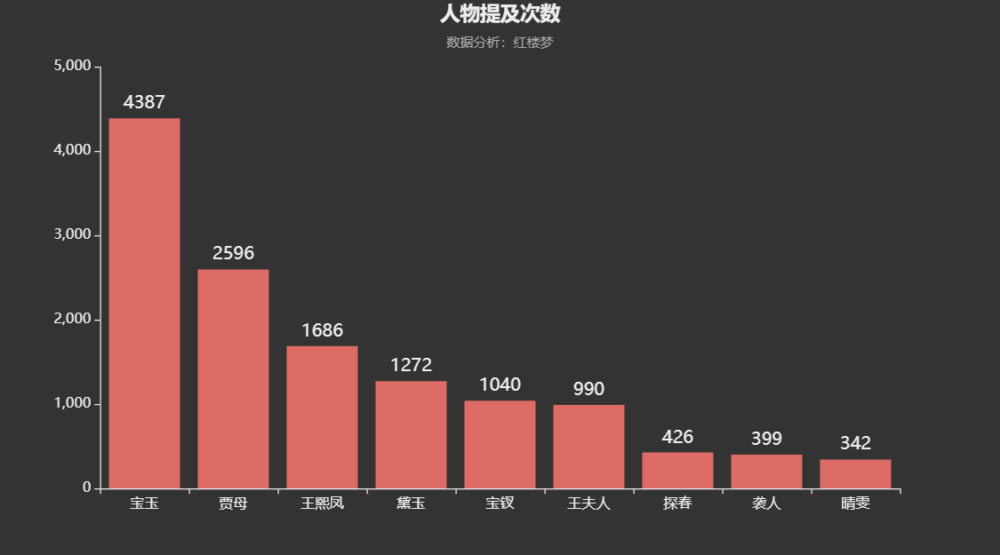
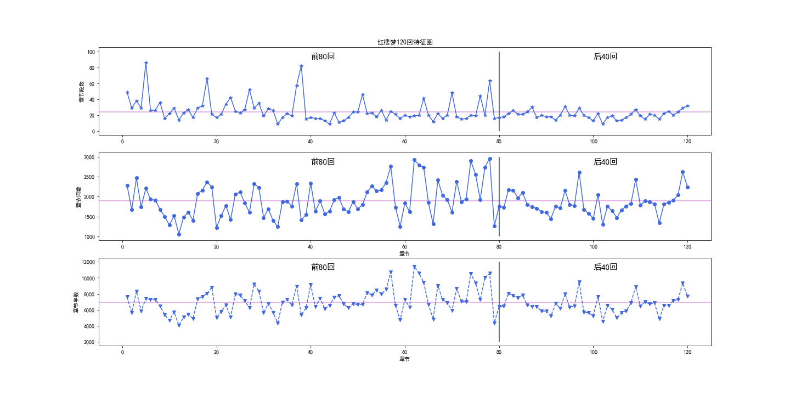
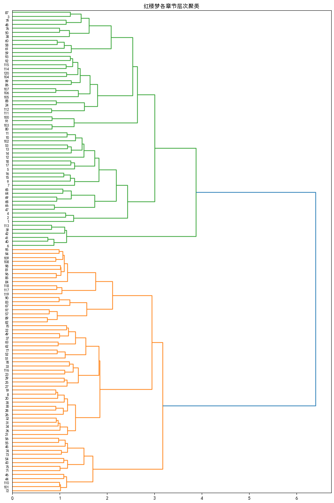

# 概述
《红楼梦》，中国古代章回体长篇小说，中国古典四大名著之一，通行本共120回，一般认为前80回是清代作家曹雪芹所著，后40回是清代作家高鹗所补。小说以贾、史、王、薛四大家族的兴衰为背景，以富贵公子贾宝玉为视角，以贾宝玉与林黛玉、薛宝钗的爱情婚姻悲剧为主线，描绘了人生百态。《红楼梦》的文学价值，可以位列四大名著之首，但由于其草蛇灰线的情节伏笔，错综复杂的人物关系及感情线索，导致仅凭寥寥数次的阅读无法领会各章节之间的关联，各角色之间的关系，难以量化分析作者用意，故本文采用文本挖掘相关技术，以**量化分析**角度重温《红楼梦》。

本文选取程乙本《红楼梦》构建语料库，处理方向有二，**一是对各章节之间的关系分析，二是对不同角色之间的关系分析**。经过对章节的整合，**对文本去除停用词、去除特殊符号、分词等预处理**，分析统计了不同章节的词数、段数、字数变化，分析前八十回同后四十回不是同一作者的可能性，后利用tf-idf特征词提取方法，提取特征词，构建特征矩阵，使用**层次聚类**法，对120回各章节内容进行聚类，清晰表示出各章节的层次关系；对于不同角色之间的关系，采用**WordVec模型**生成词向量，挖掘不同角色之间的关联度，利用**Kmeans方法进行角色间的关系聚类**，并依此绘制空间投影图及关系网络图以可视化展示。

《红楼梦》摆脱了传统小说刻板扁平的角色设定，塑造了众多丰满立体的角色形象，而读者对不同的角色有着多样化的情感态度。小说版《红楼梦》于1987年摄制成电视剧，开播以来广受观众喜爱，至今仍有大量观众在反复观看。弹幕是近些年各大主流视频播放器都会内置的功能，有其独特的实时互动性，能充分反映观众对影视内容的感情态度。本文利用爬虫方法，爬取腾讯视频87版红楼梦电视剧36集的**699046条全部弹幕**作为语料，运用**SnowNLP 及构建情感词典**方法，分析观众对不同角色的**情感偏向**。

# 对《红楼梦》书籍语料的分析

通过词云图可以发现，因为全文是以宝玉的视角进行创作，所以宝玉是当之无愧的核心角色。“宝玉”二字词频最高，然后是一些围绕着主角的其他人物角色，例如“凤姐”、“贾母”、“黛玉”等人物名字出现的频率也很高，然后是一些诸如“你们”、“我们”、“说道”等对话中的词汇，词频也很高，说明《红楼梦》包括了大量人物的对白，作者通过不同角色之间的对白来交代角色性格。

上图只展示了词频最高的前九位角色，可以看出除宝玉外，着墨最多的角色是贾母和王熙凤，因为贾母是荣国府实际的当家人，而王熙凤则是荣国府掌事；其次是黛玉宝钗，两位角色都与宝玉有着错综的情感关联；再次是贾宝玉之母，王夫人；贾府四春中只有探春进入前九名；最后是服侍宝玉的贴身侍女袭人和晴雯。

在文本预处理步骤中，不同章节都标记了开始与结束位置，因此本文统计前80回与后40回章节间段数、词数、字数的折线图，如图所示。图中紫色横线为平均值，蓝色折线为不同章节特征。可以发现，每章节段数在20行左右，章节词数在1900词左右，章节字数在7000词左右。在后40回的章节段数特征上，明显与前80回出现差别，可以为“后40回系他人续”观点提供佐证。

《红楼梦》全文共120回，章节之间互有联系，本文选用层次聚类方法，识别各章节间潜在的情节联系。
在进行文本聚类前，需要构建词向量空间模型，本文选用tf-idf逆文档频率进行特征提取。后采用余弦相似度确定文本距离，因为层次聚类无需事先确定簇的个数，所以相比Kmeans需要不断调整簇的个数，本文选用层次聚类法，利用ward确定簇与簇之间的距离，进行凝聚层次聚类。
通过红楼梦各章节层次聚类可以看出，层次聚类图可以清晰地表示章节之间的层次关系，章节和距离最近的章节进行合并，不断递归形成树。从图中我们可以看出《红楼梦》哪些章节最为接近，例如图中将79回和48回归为一类，经过查阅原文，发现“第四十八回	滥情人情误思游艺,慕雅女雅集苦吟诗”“第八十回	美香菱屈受贪夫棒,王道士胡诌妒妇方”两章均是有关香菱和薛蟠的，再比如图中将50回与76回聚合，“第五十回	芦雪庵争联即景诗,暖香坞雅制春灯谜”和“第七十六回	凸碧堂品笛感凄清,凹晶馆联诗悲寂寞”都是有关众人联诗作词的，可见模型识别较为准确。

利用word2vec处理语料资源将得到大量的词汇，在进行二维空间展示时，需要降低维度。主成分分析法(PCA)对量表的数据降维，其核心原理是保留了数据集中对方差贡献最大的若干个特征来表征全部数据对象，以达到简化数据集的目的。本文利用PCA主成分分析法进行高维数据的降维，并将降维后的词语绘制向量的二维空间投影图。

通过二维空间投影的方式，可以更直观的展现不同角色间的亲疏远近，是genism模型的可视化展示。比如文中贾环是赵姨娘的儿子，所以在投影图中二者关系较近。

本文基于社会网络分析法，利用pyecharts库中的网络图模块，选取部分角色名称作为关系图节点，将genism模型训练出的两个特征间的similarity作为边上的权重，节点大小用与其他节点关系加总值来表示，布局方式选择circular，分析研究小说人物的关系网络。绘制出的关系网络图如下图所示

抽取其中的“宝玉”节点

通过节点大小可以清楚发现“宝玉”的节点最大，说明宝玉与其他人关系均较为紧密，其次便是作为当家人的贾母，再次是掌事人王熙凤。以贾宝玉为例，林黛玉、晴雯、宝钗、紫鹃亲密程度较高，与惜春，刘姥姥亲密程度较低。

# 对电视剧弹幕语料的分析

通过折线图发现，每一集弹幕数量均在15000条上下浮动，弹幕数量最多的一集是28集，对应原文第七十六回《惑奸谗抄检大观园,矢孤介杜绝宁国府》，也即全文全剧情节高潮——“抄检大观园”，此事件是贾家由盛转衰的开始，同时在该集中晴雯受到迫害，被逐出荣国府，不久后一命呜呼。因此，弹幕充满着对晴雯的心疼，对抄家发动者王夫人的厌恶，对荣国府即将走向灭亡的慨叹，弹幕在数量上达到巅峰。

以用户ID为分组依据，对点赞数分类汇总，并排序截取收到点赞前十名的用户，绘制柱状图。可以看出用户ID为“淮宝”的用户收到的点赞数最多。

以弹幕ID为分组依据，对点赞数分类汇总，并排序截取收到点赞前六名的弹幕，绘制柱状图进行展示，可以发现弹幕最多获赞15个，通过查找弹幕ID找到了对应弹幕内容为“最讨厌的就是宝玉看宝钗的眼神，林妹妹心里多难过！”，反应了观众比较接受宝黛爱情线，对宝钗爱情较为排斥。

本文通过计算不同k取值时的困惑度，绘制困惑度曲线，选取k=9构建LDA主题模型，但训练后解释性不强，后通过不断调整k的取值，发现当k=7时，困惑度既低，解释性又较好，于是取k=7。训练后不同主题及下属词语如图所示。第一类主题为喜爱宝玉与黛玉；第二类是觉得凤姐很有趣；第三类是觉得宝钗和秦可卿都很厉害，但也较为有心计；第四类是说宝玉的住所怡红院很漂亮，红楼梦拍摄的很美；第五类第六类主题中关键词是“哭”“死”这类消极的情感，是观众对红楼梦悲剧内核的共情；最后一类主题元妃省亲。

为了更加直观的展示LDA分类结果，引入pyLDAvis库进行可视化展示，网页截图如图所示，以topic5为例，可以看出该类的关键词是“元春”“省亲”“别墅”“大观园”等，可见该类主题是红楼梦开篇部分的“元妃省亲”

本文采用SnowNLP库，随机抽取总弹幕中的一万条，对弹幕内容打分，并将打分存储为新一列“情感得分”，随机展示十条弹幕及情感得分情况，可以发现“平常百姓之家饭都吃不上”表示出对贾府奢靡生活的不满，情感得分仅为0.38分，较为消极；“邢夫人就是没有真本事到处找存在感”更是只得0.08分，十分负面；“黛玉这种古典美是无法超越的”体现出观众对黛玉的喜爱，得0.99分，说明模型识别较为准确。

接着对情感得分进行统计，绘制直方图与密度曲线，通过图可以发现，SnowNLP库的打分更倾向于积极类，得分接近1的占多数。

为了了解观众对不同角色的情感倾向，将弹幕内容与角色名字进行匹配，将提到该角色名字的弹幕情感得分均值化，得出观众对不同角色的情感倾向，

观察上图，可以得出结论，在SnowNLP评价方法中，观众对宝钗，刘姥姥的情感最为正向积极，对于王熙凤的情感则接近中立，可能是好坏参半，这也对应了王熙凤聪明伶俐但却心狠手辣的性格特点。
